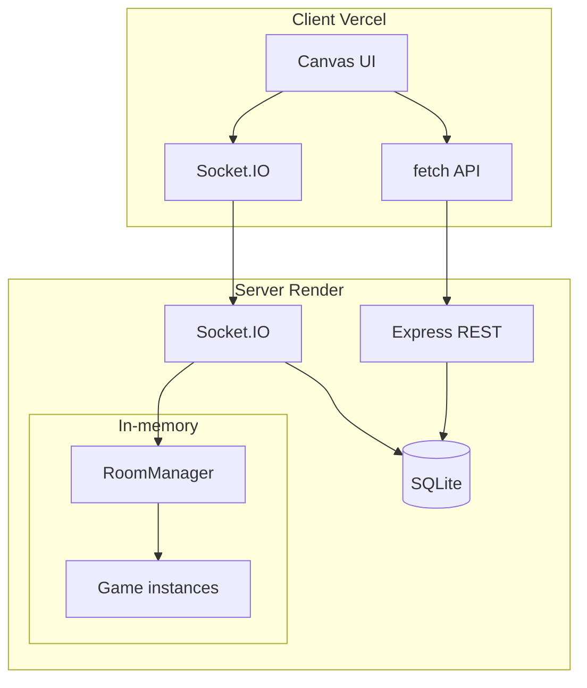
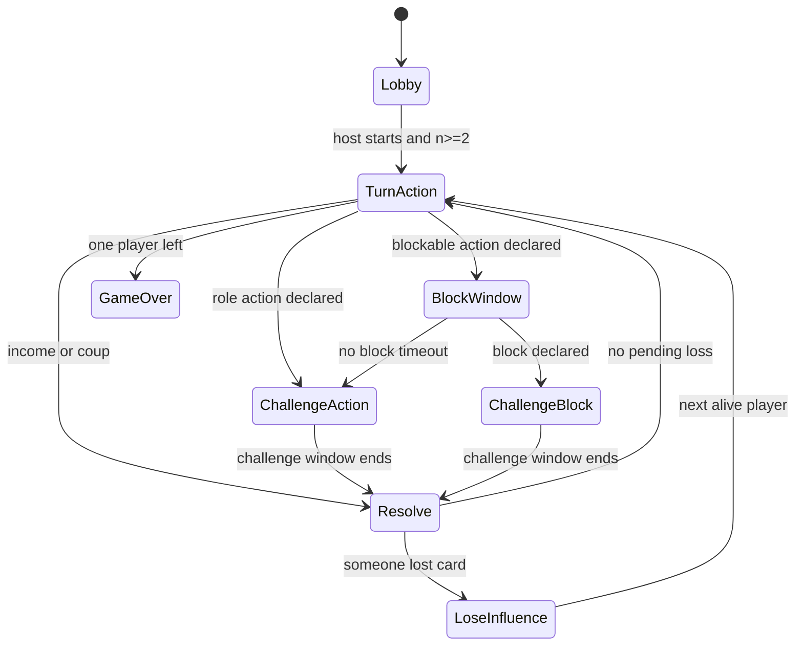

# Coup Multiplayer Web Game — Implementation Plan

---
## Important

- **Dont use the word COUP anywhere in the project**
- **Use take over instead of COUP**
- **Dont use any words that sound like a game**
- **Dont have any phrases that would make it sound like a game**

---

## Repository layout

```
Take-over/
├── client/                 # Static site → Vercel
│   ├── index.html
│   ├── css/main.css
│   └── js/
│       ├── main.js         # boot, routing screens
│       ├── api.js          # REST + credentials
│       ├── socket.js       # Socket.IO client
│       ├── canvas/
│       │   ├── renderer.js # draw loop, layout
│       │   ├── screens.js  # lobby, game, auth overlays
│       │   └── input.js    # hit regions → actions
│       └── state.js        # local view model from server events
├── server/                 # Node app → Render Web Service
│   ├── package.json
│   ├── src/
│   │   ├── index.js        # Express + HTTP server + Socket.IO
│   │   ├── config.js       # env: PORT, CLIENT_ORIGIN, SESSION_SECRET
│   │   ├── db/
│   │   │   ├── schema.sql
│   │   │   └── index.js    # better-sqlite3 wrapper
│   │   ├── auth/
│   │   │   ├── routes.js   # register, login, logout, me
│   │   │   ├── session.js  # cookie-session middleware
│   │   │   └── middleware.js
│   │   ├── friends/routes.js
│   │   ├── rooms/
│   │   │   ├── RoomManager.js  # code → room, delete when empty
│   │   │   └── Room.js
│   │   ├── game/
│   │   │   ├── deck.js     # scaled deck builder
│   │   │   ├── rules.js    # validation helpers
│   │   │   ├── Game.js     # state machine + timers
│   │   │   └── actions.js  # income, aid, tax, etc.
│   │   └── socket/
│   │       ├── index.js    # auth handshake, namespaces
│   │       └── handlers.js # room + game events
│   └── data/               # SQLite file (gitignored)
├── .gitignore
└── README.md               # local dev + deploy steps
```

## Architecture




- **Authoritative server**: deck, hands, coins, turn order, timers, and resolution live only in `[server/src/game/Game.js](server/src/game/Game.js)`. Clients receive **public projections** (own cards, others’ card *count*, coins, eliminated roles if revealed, phase, timers, pending targets).
- **Ephemeral rooms**: `[RoomManager](server/src/rooms/RoomManager.js)` holds rooms in a `Map`; when the last socket leaves, delete the room and any attached `Game`. Room codes: 6 uppercase alphanumeric, collision-checked.
- **Persistent data**: users, sessions (optional table for revocation), friendships only — not game state.

## Deck scaling (per your choice)


| Players | Decks       | Cards             |
| ------- | ----------- | ----------------- |
| 1–6     | 1           | 15 (3× each role) |
| 7–12    | 2           | 30                |
| 13–18   | 3           | 45                |
| …       | `ceil(n/6)` | `15 * ceil(n/6)`  |


Implementation in `[server/src/game/deck.js](server/src/game/deck.js)`:

```js
function deckCountForPlayers(n) {
  return Math.max(1, Math.ceil(n / 6));
}
```

Shuffle full multi-deck, deal 2 influence each, remainder is draw pile. If `2 * n > totalCards`, reject join (should not happen with this formula).

## Coup rules engine (server)

### Roles and actions

- **Income** — +1 coin, unblockable.
- **Foreign aid** — +2 coins; blockable by Duke.
- **Coup** — 7 coins, target loses 1 influence; unblockable. (10+ coins forcd to coup)
- **Tax** (claim Duke) — +3 coins; challengable.
- **Assassinate** (claim Assassin, 3 coins) — target loses 1 influence; blockable by Contessa; challengable.
- **Steal** (claim Captain) — steal up to 2 from target; blockable by Captain or Ambassador; challengable.
- **Exchange** (claim Ambassador) — draw 2, mix with hand, return 2 to deck; challengable. (makje sure it knows before picking up card wheather they have ambassador)

### Turn / phase state machine




**Order (official)**:

1. Active player declares action (+ target if needed) → start **60s** `turn_action` timer.
2. If action requires a role → **30s** `challenge_action` (any other player may challenge).
3. Resolve challenge (reveal card, loser loses influence, shuffle discarded character back into deck per standard rules).
4. If blockable → **30s** `block_window` for target (and only valid block roles).
5. If block declared → **30s** `challenge_block`. (Make sure that anyone can challenge and they can still challenge the person that used the blockable card)
6. **Resolve** action effects (coins, steal, exchange UI step, assassination, etc.).
7. If a player must lose influence → `lose_influence` phase (that player picks which card; **30s** timeout → server picks random).
8. Advance to next alive player clockwise; eliminated players skipped.
9. Win when exactly one player has influence remaining.

Timers: `setTimeout` + emit `phaseEndsAt` ISO timestamp on each transition so clients can render countdown after reconnect.

### Challenge resolution (server)

- On challenge, pausing window; challenged player must prove role:
  - **Has role**: reveal that card, shuffle it into deck, draw replacement (Ambassador exchange uses separate flow), challenger loses 1 influence.
  - **Lacks role**: challenged player loses 1 influence; action/block fails.
- Only one challenge per action/block window (first valid challenger wins queue & exception: if someone does a blockable card and someone block you can challenge both ex captain steals ambassodor blocks you can challenge both).

### Hidden vs public state

`Game.getPlayerView(socketUserId)` returns:

```js
{
  phase, phaseEndsAt, activePlayerId,
  you: { cards, coins, id },
  players: [{ id, username, coins, cardCount, eliminated, revealedCard? }],
  pending: { action, actorId, targetId?, blockRole? },
  log: [/* last N public events */]
}
```

Never send opponents’ cards unless revealed by challenge/elimination.

## Authentication and sessions

**REST** (`[server/src/auth/routes.js](server/src/auth/routes.js)`):

- `POST /api/auth/register` — `{ username, password }` (username unique, 3–20 chars, alphanumeric + underscore).
- `POST /api/auth/login`
- `POST /api/auth/logout`
- `GET /api/auth/me`

**Storage** (`[server/src/db/schema.sql](server/src/db/schema.sql)`):

- `users(id, username UNIQUE, password_hash, created_at)` — in future add stats like wins losses games played 
- `friends(user_id, friend_id, created_at)` — symmetric optional; store directed rows both ways on accept, or single row with `status` (`pending`/`accepted`).

**Security**:

- `bcrypt` cost 10–12.
- `cookie-session` or `express-session` + SQLite store; cookie: `httpOnly`, `secure` in prod, `sameSite: 'none'` for cross-origin Vercel → Render.
- keep you logged in acros reload of website
- Socket.IO middleware: parse session cookie on handshake; attach `user` to `socket.data`; reject unauthenticated game events (allow read-only guest? **No** — login required to play).

## Friends list

- `GET /api/friends` — list usernames + `online` + `inRoomCode` (if in a room) + join button. 
- `POST /api/friends` — `{ username }` add friend.
- `DELETE /api/friends/:username`
- On socket connect/disconnect, update presence map; emit `friends:presence` to affected users.
- Client: friends panel with “Join room” button when `inRoomCode` is set and game is in `lobby` phase.
- Make servers private where only friends can join even if have code
- make some servers public where anyone can join 

## Socket.IO events


| Client → Server  | Purpose                                                                                                                                                             |
| ---------------- | ------------------------------------------------------------------------------------------------------------------------------------------------------------------- |
| `room:create`    | Create room, host joins specify lobby type                                                                                                                          |
| `room:join`      | `{ code } or via friend or public game just join if mid game spectate and see everyone hand if you dies you see everyones hand and can tell which ones are face up` |
| `room:leave`     | Leave room                                                                                                                                                          |
| `game:start`     | Host only, ≥2 players                                                                                                                                               |
| `game:action`    | `{ type, targetId? }` during turn                                                                                                                                   |
| `game:block`     | `{ blockRole }` during block window                                                                                                                                 |
| `game:challenge` | During challenge windows                                                                                                                                            |
| `game:pass`      | Pass on block/challenge                                                                                                                                             |
| `game:loseCard`  | `{ cardIndex }`                                                                                                                                                     |
| `game:exchange`  | `{ keptCardIds }` Ambassador resolution                                                                                                                             |


| Server → Client    | Purpose                        |
| ------------------ | ------------------------------ |
| `room:state`       | Lobby roster, host, code       |
| `game:state`       | Full public view for recipient |
| `game:error`       | `{ message }`                  |
| `friends:presence` | Friend online/room updates     |


All handlers validate: correct phase, active player, sufficient coins, valid targets, alive players only.

## Canvas front-end

Single full-viewport `<canvas>` with responsive layout (`[client/js/canvas/renderer.js](client/js/canvas/renderer.js)`):

**Screens** (HTML overlays for forms only — login/register; everything else Canvas):

1. **Auth** — minimal HTML forms (Canvas text input is painful for passwords).
2. **Home** — Create room, Join by code, Friends list.
3. **Lobby** — player list, host Start, copy code.
4. **Game table** — circular player positions, avatars/names, coin counts, card backs + your two cards, center action log.
5. **Action bar** — Income, Foreign Aid, Coup, character actions (enabled/disabled by server hints in `game:state`).
6. **Modal overlays** — Block picker, Challenge/Pass, Lose influence (click card), Exchange (pick 2 to keep).

**Input**: map click coordinates to regions; emit socket events. Re-render on `game:state` and `requestAnimationFrame` for smooth timer display.

**Config**: `window.__API_URL__` / `__SOCKET_URL__` injected via `client/config.js` (Vercel env) or build-time replacement.

## Deployment


| Piece     | Host        | Notes                                                                                                                                                       |
| --------- | ----------- | ----------------------------------------------------------------------------------------------------------------------------------------------------------- |
| Front-end | **Vercel**  | Root `client/`; `vercel.json` rewrites; env `VITE_API_URL` or inline `config.js`                                                                            |
| Back-end  | **Render**  | Web Service, `npm start`, health `GET /health`                                                                                                              |
| SQLite    | Render disk | Mount persistent disk at `server/data` on Render (free web services lose disk on redeploy without disk — document in README; optional nightly backup later) |


**CORS**: `CLIENT_ORIGIN=https://your-app.vercel.app`, `credentials: true`.

**Socket.IO**: same Render URL; client `io(API_URL, { withCredentials: true })`.

## Implementation order

1. **Server scaffold** — Express, SQLite schema, auth routes, session cookies, health check.
2. **RoomManager + lobby sockets** — create/join/leave, ephemeral cleanup, room codes.
3. **Game engine core** — deck scaling, deal, turn rotation, income/aid/coup without challenges.
4. **Challenge/block windows** — full state machine + timers.
5. **Remaining actions** — tax, assassinate, steal, exchange + influence loss.
6. **Friends API + presence** — REST + socket broadcasts.
7. **Canvas client** — auth → lobby → game loop wired to all events.
8. **Deploy configs** — `vercel.json`, Render `render.yaml` or dashboard instructions, README.

## Key risks and mitigations

- **Render free SQLite persistence**: use Render persistent disk for `data/coup.db`; warn that free tier sleeps — first request cold start ~30s.
- **Cross-origin cookies**: must set `sameSite: 'none'` + `secure: true` and HTTPS everywhere.
- **Reconnect**: on socket reconnect, re-join room by code stored client-side; server re-sends `game:state` for that user.
- **Timer races**: server clears timeouts on phase change; ignore late client events with `game:error`.

## Dependencies (server)

`express`, `socket.io`, `better-sqlite3`, `bcrypt`, `cookie-session` (or `express-session` + `connect-sqlite3`), `cors`, `uuid`, `nanoid` (room codes).

## Dependencies (client)

None required (vanilla JS); Socket.IO via CDN ESM or copied client bundle.

## Testing approach (manual checklist in README)

- Register/login, session persists on refresh.
- Create/join room, 2 players start, deck size correct for 6 vs 7 players.
- Income, Foreign Aid + Duke block, challenge success/fail.
- Coup at 7 coins, steal, assassinate + Contessa block.
- Turn timeout auto-passes or defaults to Income.
- Empty room deletes; friend sees room code while friend is in lobby.

