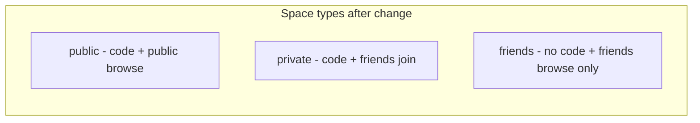
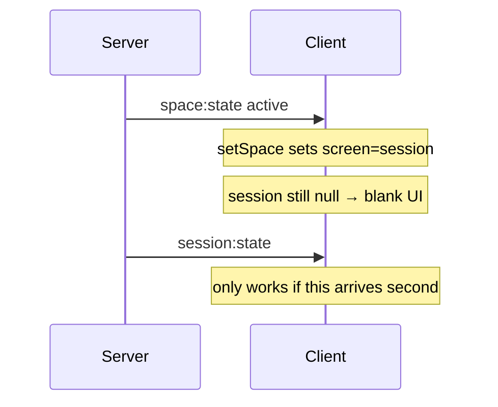

# Guest play, public browse fix, real-time friends, friends-only space

## Current state

| Feature | Today |
|---------|--------|
| Browse public | Button [`list-public`](client/js/main.js) calls `space:listPublic`; list only renders if `publicSpaces.length > 0` in [`renderer.js`](client/js/canvas/renderer.js) — no empty message, often below the fold after the friends list |
| Guest play | Not implemented — socket rejects unauthenticated handshakes ([`server/src/socket/index.js`](server/src/socket/index.js)) |
| Friend online | `friends:presence` socket event exists, but disconnect clears `spaceCode` while the user stays in the room; add/remove friend does not push updates |
| Private space | `visibility: 'private'` + 6-char code; join allowed if friend of any member |
| Friends space (new) | **Does not exist** — you want codeless, friends-only discoverable rooms |
| Game start / play | ~50% blank screen: `setSpace` switches to session before `session:state` arrives; block phase shows buttons to everyone but server rejects most clicks; `pass()` does not end phase when all pass |



---

## 1. Fix "Browse public spaces"

**Root causes (likely combined):**
- Empty list looks like nothing happened (no UI feedback).
- Public list is drawn under up to 8 friends — easy to miss on smaller screens.
- `emit()` fails with "Not connected" if clicked before the socket connects ([`client/js/socket.js`](client/js/socket.js) line 22).

**Changes:**

1. **[`client/js/socket.js`](client/js/socket.js)** — add `waitForSocket()` that resolves on `connect` (with timeout + clear error).
2. **[`client/js/main.js`](client/js/main.js)** — use `waitForSocket()` in `onSignedIn` before rejoin/`emit`; on `list-public`, set `appState.browsePublicOpen = true` and toast on error.
3. **[`client/js/state.js`](client/js/state.js)** — add `browsePublicOpen`, `friendSpaces`, `browseFriendsOpen`.
4. **[`client/js/canvas/renderer.js`](client/js/canvas/renderer.js)** — when `browsePublicOpen`, show a **Public spaces** block immediately under the browse button (not below friends):
   - If empty: `"No public spaces waiting — create one or try again later."`
   - If populated: code + member count + Join (unchanged).
5. Optional small UX: loading toast `"Loading…"` while `space:listPublic` runs.

No server change required for listing (already returns waiting public rooms in [`RoomManager.listPublicWaiting()`](server/src/rooms/RoomManager.js)).

---

## 2. Play as guest (no account)

**Approach:** ephemeral guest identity in the **session cookie only** (no Turso row, no password).

**Server**

- **[`server/src/auth/routes.js`](server/src/auth/routes.js)** — `POST /api/auth/guest`:
  - Set `req.session.guestId = uuid`, `req.session.username = Guest_<shortid>`, `req.session.isGuest = true`
  - Clear any prior `userId`
  - Return `{ id, username, isGuest: true }`
- **[`server/src/auth/middleware.js`](server/src/auth/middleware.js)** / **`GET /me`** — accept guest session the same shape as a user.
- **[`server/src/socket/index.js`](server/src/socket/index.js)** — middleware branch:
  - If `req.session.isGuest` → `socket.data.user = { id: guestId, username, isGuest: true }` (skip `findUserById`)
  - Else existing registered-user flow
- **Guests and friends:** skip `listFriends` / `notifyFriends` for `isGuest` (no friends DB rows). [`onConnect`](server/src/socket/index.js) only emits `friends:presence` for registered users.

**Client**

- **[`client/index.html`](client/index.html)** — add **Play as guest** button on auth panel.
- **[`client/js/api.js`](client/js/api.js)** — `auth.guest()`.
- **[`client/js/main.js`](client/js/main.js)** — guest flow uses same `onSignedIn` but skips `loadFriends` / add-friend UI when `user.isGuest`.
- **[`client/js/canvas/renderer.js`](client/js/canvas/renderer.js)** — home screen for guests: public create/join/browse/code join only; hide Friends section and private/friends-space create buttons.

**Guest permissions**

| Action | Guest |
|--------|-------|
| Create/join **public** space | Yes |
| Join with code (public) | Yes |
| Create/join **private** / **friends** space | No (requires friend graph) |
| Add friends | No |

---

## 3. Real-time friend online / in-space updates

**Bug:** On socket disconnect, [`socket/index.js`](server/src/socket/index.js) calls `setUserSpace(userId, null)`, but [`handlers.js`](server/src/socket/handlers.js) only nulls `member.socketId` — the user **stays in the room**. Friends briefly see them offline or lose the Join button.

**Fixes:**

1. **Remove `setUserSpace(userId, null)` from the disconnect handler** in [`server/src/socket/index.js`](server/src/socket/index.js). Only clear `spaceCode` on [`space:leave`](server/src/socket/handlers.js) (already does).
2. **On connect**, if user is still in a room (`roomManager.getByUser`), call `setUserSpace(user.id, room.code)` in `onConnect`.
3. **[`server/src/friends/routes.js`](server/src/friends/routes.js)** — after `POST` / `DELETE`, call `notifyFriends` for both users (wire `notifyFriends` from [`attachSocket`](server/src/index.js) into friends routes, same pattern as socket).
4. **[`client/js/main.js`](client/js/main.js)** — on socket `connect` / `reconnect`, call `loadFriends()` as a fallback snapshot.
5. Delete dead stub `emitFriendsPresence` at bottom of [`handlers.js`](server/src/socket/handlers.js).

`online` continues to mean “has an active socket”; `spaceCode` means “currently in a space” (even if tab closed briefly).

---

## 4. New "Friends space" (no code, friends only)

**Third visibility:** `friends` (distinct from `private`).

| | Public | Private | **Friends (new)** |
|--|--------|---------|-------------------|
| Code shown / join by code | Yes | Yes | **No** |
| Who can join | Anyone (with code) | Friends of a member | **Friends of host only** |
| Discovery | Browse public | Code / friend’s `spaceCode` | **Browse friends’ spaces** |

**Server**

- **[`server/src/rooms/Room.js`](server/src/rooms/Room.js)** — extend `VISIBILITY` with `friends: 'friends'`.
- **[`server/src/rooms/RoomManager.js`](server/src/rooms/RoomManager.js)** — `listFriendsWaiting(userId)`:
  - Rooms where `visibility === friends`, `status === waiting`, and `areFriends(userId, hostId)`.
- **[`server/src/socket/handlers.js`](server/src/socket/handlers.js)**:
  - `space:create` accepts `visibility: 'friends'`.
  - `space:listFriends` → returns `listFriendsWaiting(user.id)`.
  - `space:join` for `friends` rooms: require `areFriends(user.id, room.hostId)`; **reject** join-by-code from non-friends (code not exposed in UI anyway).
  - `toLobbyState()` for friends rooms: omit `code` from client payload **or** send `code: null` and client never displays it.
- **Presence:** for friends rooms, do not expose `spaceCode` to non-friends (only friends see host in a friends space via `notifyFriends`).

**Client**

- **[`client/js/canvas/renderer.js`](client/js/canvas/renderer.js)** — button **New friends space** (registered users only).
- **Browse friends’ spaces** button → `space:listFriends`, show list like public browse (with empty state).
- **[`client/js/main.js`](client/js/main.js)** — handlers `create-friends`, `list-friends`, `join-friend-space-<hostId>` (join by internal id or server returns a join token — simplest: server returns `hostId` in list item and join event `space:joinFriends { hostId }` to avoid leaking codes).

**Join API shape (recommended):**

```js
// list item: { hostId, hostUsername, memberCount }
space:joinFriends { hostId }  // server finds waiting friends room for that host
```

Private spaces unchanged: still show code, copy button, friend Join via `spaceCode` on friends list.

---

## 5. Fix game start blank screen, block phase, and broken interactions

Reported behavior: ~50% of the time when the host starts a game, **both players** land on what looks like a blank/block screen; buttons during play (actions, pass, counter, lose token) often do nothing.

### Root causes (from code review)

**A. ~50% blank screen at game start (race condition)**

On `session:start`, the server emits in this order ([`handlers.js`](server/src/socket/handlers.js) lines 99–100):

1. `space:state` (status `active`)
2. `session:state` (full game view)

On the client, [`setSpace`](client/js/state.js) sets `screen = 'session'` as soon as `space.status === 'active'`, **before** `session:state` may arrive. [`drawSession`](client/js/canvas/renderer.js) returns immediately if `!state.session` → **empty dark canvas** (no action buttons except possibly nothing clickable).

Socket delivery order is not guaranteed → roughly **50/50** whether `session:state` or `space:state` wins the race.



**B. “Block screen for both” during play**

When the active player declares a **blockable** action (`support`, `strike`, `seize`), the game enters phase `block` ([`Session.js`](server/src/session/Session.js)). [`drawBlockBar`](client/js/canvas/renderer.js) shows counter buttons to **everyone**, but server-side only the **target** (or eligible counter) can use `session:block`. Other players’ clicks fail silently or toast “Only target can counter” — feels like the UI is broken.

Additionally, [`pass()`](server/src/session/Session.js) adds the user to `passed` but **never checks if everyone eligible has passed**; only the 30s timer calls `endBlockWindow` / `endChallengeAction`. Players expect Pass to advance the game immediately.

**C. Other interaction gaps**

- Lose-token clicks: hit regions use id `lose-0` but [`main.js`](client/js/main.js) handler is correct; verify `cardIndex` is passed on every lose-token hit path.
- If `session:state` is never received (`member.socketId` null after disconnect), [`broadcastSession`](server/src/socket/handlers.js) skips that player — all interactions fail until rejoin.
- `checkWinner()` sets `phase = over` without `emitUpdate()` — clients may miss game-over state until next action.

### Fixes

**Client — session screen gating**

1. **[`client/js/state.js`](client/js/state.js)** — `setSpace` must **not** set `screen = 'session'` by itself. Only `setSession` (or a helper) sets session screen when `session` payload exists.
2. **[`client/js/main.js`](client/js/main.js)** — on `space:state` with `active`, keep `screen = 'waiting'` or show a **“Starting game…”** overlay until first `session:state` arrives.
3. **[`client/js/canvas/renderer.js`](client/js/canvas/renderer.js)** — if `screen === 'session'` but `!session`, draw loading text instead of returning early with a blank canvas.

**Server — atomic game start**

4. **[`server/src/socket/handlers.js`](server/src/socket/handlers.js)** — prefer **one** event for game start, e.g. `session:started` with `{ space, sessionView }`, or emit `session:state` **before** `space:state`, or bundle both in a single ack to the room.

**Server — pass / block phase logic**

5. **[`server/src/session/Session.js`](server/src/session/Session.js)** — after `pass(userId)`, if all eligible non-actor players have passed, call `endChallengeAction()` / `endBlockWindow()` / `endChallengeBlock()` immediately.
6. Add helper `_eligiblePassers()` per phase (non-eliminated, not the actor/challenger, etc.).

**Client — block phase UX**

7. **[`client/js/canvas/renderer.js`](client/js/canvas/renderer.js)** — in `block` / `challenge_*` phases:
   - Show pending action text (“Alice declared strike on Bob”).
   - Only enable counter/pass buttons for players the server would accept (derive from `pending`, `you.id`, `activeId` — mirror server rules).
   - Show “Waiting for others…” for players who cannot act.

**Reconnect / broadcast**

8. On socket reconnect while in an active room, re-attach `socketId` and **re-broadcast** `session:state` to that client ([`handlers.js`](server/src/socket/handlers.js) + `onConnect` in [`socket/index.js`](server/src/socket/index.js)).
9. `checkWinner()` → call `emitUpdate()` after setting `phase = over`.

### Game-flow test checklist (add to section 6)

6. Host clicks **Begin** 10× (or 2 browsers) → never blank screen; both always see tokens and action bar on turn 1.
7. Declare **support** / **strike** → non-actors see disabled UI + Pass works; phase advances when all pass (not only after 30s).
8. **Lose standing** phase → clicking a token works; game continues.
9. Disconnect one player mid-game → reconnect → controls work again.

---

## 6. Files to touch (summary)

| Area | Files |
|------|--------|
| Auth / guest | `server/src/auth/routes.js`, `server/src/auth/middleware.js`, `client/index.html`, `client/js/api.js` |
| Socket / presence | `server/src/socket/index.js`, `server/src/socket/handlers.js`, `server/src/friends/routes.js`, `server/src/index.js` |
| Rooms | `server/src/rooms/Room.js`, `server/src/rooms/RoomManager.js` |
| Game session | `server/src/session/Session.js`, `server/src/socket/handlers.js` |
| Client UI / flow | `client/js/main.js`, `client/js/state.js`, `client/js/socket.js`, `client/js/canvas/renderer.js` |

---

## 7. Manual test checklist

1. **Guest:** Play as guest → create public space → second browser (guest or registered) joins via browse or code.
2. **Browse public:** Click browse with 0 rooms → see empty message; create public room in another tab → browse again → see room and join.
3. **Friends real-time:** Two registered users, friends; A goes online/offline → B’s ●/○ updates without refresh; A creates space → B sees `spaceCode`/Join; A disconnects tab → B still sees Join (spaceCode kept).
4. **Friends space:** A creates friends space (no code shown); B (friend) browses friends’ spaces and joins; C (non-friend) cannot join.
5. **Private:** Still has code; friend can join via code or friend list `spaceCode`.
6. **Game start:** Begin game repeatedly — no blank screen; both clients see the table and turn UI.
7. **Block phase:** Blockable action → Pass advances when all eligible players passed; only eligible player sees active counter buttons.
8. **Lose standing / reconnect:** Token loss selection works; reconnecting player can act again.

**Note:** Rooms remain in-memory on Render — a cold start clears all spaces; Turso only persists accounts/friends.
