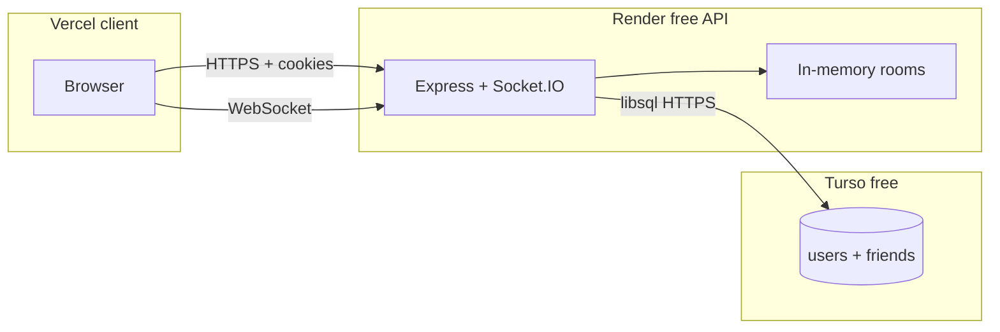

# Turso + Render Free Deployment Plan

## Database choice: **Turso** (not Supabase or Neon)

| Criterion | Turso | Supabase / Neon |
|-----------|-------|-----------------|
| SQL dialect | SQLite (same as today) | Postgres — schema and queries must be rewritten |
| Code churn | ~1 module + `await` at call sites | New driver, new schema, `INSERT OR IGNORE` / `COLLATE NOCASE` changes |
| Free tier fit | 5GB storage, billions of row reads/month — far more than 4–10 daily users | Also generous, but unnecessary migration cost |
| Local dev | `file:./data/takeover.db` via `@libsql/client` | Requires cloud DB or Docker even for local |

**Supabase/Neon** are strong products but wrong fit here: the app has a single 74-line DB layer ([server/src/db/index.js](server/src/db/index.js)) and [server/src/db/schema.sql](server/src/db/schema.sql) written for SQLite. Turso is hosted libSQL/SQLite — reuse schema and queries with minimal edits.

---

## Architecture after change

- **Render (free):** Node API + Socket.IO only; no persistent disk.
- **Turso (free):** `users` and `friends` tables (same schema); survives spin-down/redeploy.
- **Vercel (free):** Static `client/` unchanged except production `config.js` URLs.
- **In-memory (unchanged):** Rooms, game state, online presence — still ephemeral on restart (acceptable for your scale).

---

## Implementation steps

### 1. Dependencies and config

**[server/package.json](server/package.json)**

- Remove `better-sqlite3` (native addon; unnecessary on Render).
- Add `@libsql/client`.

**[server/src/config.js](server/src/config.js)**

- Add `tursoUrl` / `tursoAuthToken` from `TURSO_DATABASE_URL` and `TURSO_AUTH_TOKEN`.
- Local default: `file:./data/takeover.db` (no token) so dev works without a Turso account.
- Production: Render sets `libsql://...` + token from Turso dashboard.

**[server/.env.example](server/.env.example)**

- Replace `DB_PATH` with Turso vars and a short comment for local `file:` vs remote `libsql://`.

### 2. Rewrite DB layer (core change)

**[server/src/db/index.js](server/src/db/index.js)**

Replace `better-sqlite3` sync API with `@libsql/client`:

- `initDb()` — `createClient()`, run [schema.sql](server/src/db/schema.sql) on startup (idempotent `CREATE TABLE IF NOT EXISTS`).
- Convert all exports to **async**: `findUserByUsername`, `findUserById`, `createUser`, `listFriends`, `addFriend`, `removeFriend`, `areFriends`.
- Map rows: libsql returns `result.rows` with typed accessors (normalize to same object shape callers expect: `password_hash`, etc.).
- **Transactions** (`addFriend` / `removeFriend`): use `client.batch([...], "write")` for the two reciprocal INSERT/DELETE statements.
- Remove filesystem `mkdir` / `DB_PATH` logic for production; optional keep for local `file:` URLs only.

SQL stays the same; verify `COLLATE NOCASE` and `INSERT OR IGNORE` against Turso once during testing (both are standard SQLite).

### 3. Update callers to `await`

| File | Changes |
|------|---------|
| [server/src/index.js](server/src/index.js) | `await initDb()` before `server.listen` |
| [server/src/auth/routes.js](server/src/auth/routes.js) | `await findUserByUsername`, `await createUser` in register/login |
| [server/src/friends/routes.js](server/src/friends/routes.js) | `await` on all DB calls in GET/POST/DELETE |
| [server/src/socket/index.js](server/src/socket/index.js) | `io.use` → async; `await findUserById`; `notifyFriends` / `onConnect` → async + `await listFriends` |
| [server/src/socket/handlers.js](server/src/socket/handlers.js) | `space:join` handler → `async`; `await areFriends(...)` in private-room gate |

No client-side changes required.

### 4. Render deploy config (free tier)

**[render.yaml](render.yaml)**

- **Remove** `disk` block and `DB_PATH` env var (paid-only, not needed).
- **Add** env vars (set manually in dashboard or blueprint):
  - `TURSO_DATABASE_URL` — `sync: false`
  - `TURSO_AUTH_TOKEN` — `sync: false`
- Keep: `NODE_ENV`, `SESSION_SECRET` (generate), `CLIENT_ORIGIN`, health check, `rootDir: server`.

### 5. Documentation and deploy checklist

**[README.md](README.md)** — replace disk instructions with:

**Turso setup (one-time)**

1. Create account at [turso.tech](https://turso.tech).
2. Create database (CLI: `turso db create takeover` or dashboard).
3. Copy connection URL + auth token into Render env vars.

**Render (free API)**

1. Deploy from `render.yaml` (no disk).
2. Set `CLIENT_ORIGIN` to Vercel URL.
3. Set `TURSO_DATABASE_URL` + `TURSO_AUTH_TOKEN`.

**Vercel (unchanged)**

1. Root directory `client`.
2. Point [client/config.js](client/config.js) at Render API URL.

**Optional:** note free uptime ping on `/health` during play hours to reduce Render cold starts (not required for DB persistence).

**[client/config.example.js](client/config.example.js)** — no change needed.

---

## Manual verification (before/after deploy)

Run locally with `file:./data/takeover.db`, then smoke-test against Turso dev DB:

- [ ] Register / login / refresh — session persists (cookie)
- [ ] Add friend — survives **server restart** (proves Turso, not memory)
- [ ] Private space: non-friend blocked, friend allowed
- [ ] Public space + live game still work (in-memory unaffected)
- [ ] Production: `CLIENT_ORIGIN` + `config.js` URLs match; cookies work cross-origin

---

## Post-deploy operator checklist (for you)

1. Turso: create DB, get URL + token.
2. Render: connect repo, deploy blueprint, set `CLIENT_ORIGIN`, `TURSO_*`, confirm **no disk** attached.
3. Vercel: deploy `client/`, set `__API_URL__` / `__SOCKET_URL__` to Render URL.
4. Render: set `CLIENT_ORIGIN` to final Vercel URL, redeploy if needed.
5. Run README manual test checklist in production.

---

## Risk notes (low for this project)

- **Latency:** Each auth/friend op is a round-trip to Turso (~tens of ms). Fine for login/friend checks; not on hot game-tick path.
- **Socket middleware:** Must be `async`; ensure errors call `next(err)` so unauthorized users still fail closed.
- **Cold start:** Render free still spins down; Turso does **not** spin down — accounts/friends stay; only first HTTP wait remains.

---

## Files touched (summary)

| File | Action |
|------|--------|
| `server/package.json` | Swap DB dependency |
| `server/src/config.js` | Turso env vars |
| `server/src/db/index.js` | libSQL async client |
| `server/src/index.js` | Async init |
| `server/src/auth/routes.js` | Await DB |
| `server/src/friends/routes.js` | Await DB |
| `server/src/socket/index.js` | Async socket auth + friends |
| `server/src/socket/handlers.js` | Async `areFriends` |
| `server/.env.example` | Turso vars |
| `render.yaml` | Remove disk; add Turso env |
| `README.md` | Free deploy guide |

No changes to `client/`, game rules, or `vercel.json`.
